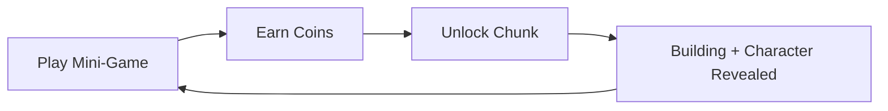
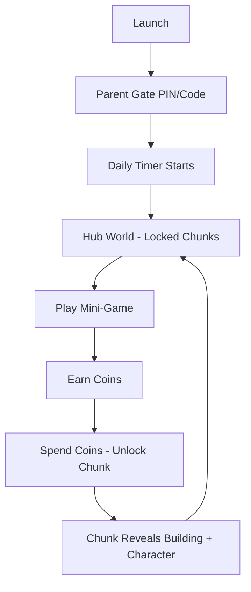

# Project FF MVP — Agent Guide

## Product Identity

A free-to-play educational mobile game combining 2D mini-games with 3D isometric world-building. Built for Android (Unity 2022.3 LTS, URP).

**Target audience:** Kids aged 3–8, split into two experience tiers:
- **Under 6:** Short sessions (≤30 min), simpler games, voice + icon driven (no text).
- **Ages 6+:** Longer play limits, advanced progression.

**North Star:** Give parents total peace of mind — hand the device to their child, trust they're learning in a safe, productive environment.

---

## Core Game Loop

1. **Play:** Kid plays 2D mini-games (endless, educational, story-driven) to earn coins.
2. **Build:** Spend coins to unlock chunks of the isometric map and place buildings.
3. **Expand:** Each chunk unlocked reveals new buildings (bakery, mosque, etc.) and characters who live there — creating ownership and motivation.

---

## The Hook: Character Interaction

- A popular character asks the child for help: *"My city is empty. Will you help me build it?"*
- Characters cheer during mini-games with voice lines.
- When a building is finished, the character moves in visually.

---

## The Two User Experiences

**Child:**
- Opens app → requires parent permission (code/pin).
- Sees an empty locked 3D map with one starting ground chunk.
- Plays mini-games to earn coins → unlocks chunks → each chunk has 3 game categories (forces balanced learning).
- Chunks reveal buildings and character homes → kid feels ownership and wants to expand.

**Parent:**
- Grants permission, sets daily playtime limits.
- Tracks learning progress and safety limits.
- Receives progress notifications: *"Your child excels at X but needs practice with Y."*

---

## MVP Demo Deliverables

| Priority | Deliverable | Definition of Done |
|----------|-------------|-------------------|
| **P0** | 2.5D hybrid loop | Play a mini-game → earn currency → unlock a chunk/ building → see it in the isometric world. Repeat. |
| **P0** | Parent gate | Pin/code screen at launch preventing access without parent approval. |
| **P0** | One complete mini-game | Fully playable, wired in Unity, generates a reward. |
| **P0** | Isometric hub with chunk system | Grid-based world where locked chunks are visible but inaccessible; unlocking animates them in. |
| **P1** | Architecture & localization | Clean separation of concerns, Arabic/English text via RTLTextMeshPro, voice-guidance ready. |
| **P1** | UI/UX | Kid-friendly, icon-driven, minimal text, bright palette, clear feedback on actions. |
| **P1** | Save system | Firebase cloud save/load of inventory and progress. |
| **P2** | Character companion | At least one character present in hub, with voice line on game start and building unlock. |
| **P2** | Reward celebration screen | Mini-game end screen with coins earned, animations, character reaction. |
| **P2** | Session timer | Enforce daily play limit set by parent. |

---

## 4-Week Delivery Plan

| Week | Focus |
|------|-------|
| **W1** | Foundation — parent gate, architecture, localization, Firebase |
| **W2** | Hub world — 3D isometric chunk grid, building placement |
| **W3** | Mini-game — one complete game wired to the hub loop |
| **W4** | Polish — character companion (simple DOTween), session timer, QA, ship

---

## Experience Flow

No onboarding text. Everything taught via character voice guidance and visual icons.

---

## Foundational Principles

1. **Voice + icons over text** — kids under 6 may not read. Every instruction must work without text.
2. **Feedback is fuel** — every action (coin earned, chunk unlocked, building placed) must have instant positive feedback (sound, animation, character reaction).
3. **Forced variety** — each chunk demands games from multiple categories so the child learns across domains, not just their favorite game type.
4. **Ownership drives retention** — visible progress (a growing town with character homes) makes the child want to come back and expand.
5. **Parent trust is the product** — without safety controls, the app won't be installed. Parent gate + time limits + progress reports are features, not afterthoughts.

---

## What NOT to Do

- Do not add gameplay complexity before the core loop (play → earn → build → see) works end-to-end.
- Do not build multiple mini-games until one is fully polished and wired.
- Do not invest in animations, audio, or polish until the playable loop is solid.
- Do not ship without a parent gate — it is a hard requirement for the target demographic.
- Do not add text-dependent UI. Assume the child cannot read.

---

## Current Status

| Phase | Status |
|-------|--------|
| **W1 — Foundation** | ✅ Complete (Architecture solid, localization infra works, secure onboarding & settings parent gate fully implemented) |
| **W2 — Hub World** | ✅ Phase 2 implementation complete (see details below) |
| **W3 — Mini-Game** | ✅ Playable, fully integrated with hub loop. Cosmic Hopper ready. |
| **Clean Up Phase** | ✅ Complete. Decoupled and refactored core, camera, inputs, save fallback, and localizations. |
| **Architecture Refactoring** | ✅ Complete. Code audit fixes, ServiceLocator, singleton mesh decoupling, scene cleanup. |
| **W4 — Polish** | ⏳ Next up (Character companion, session timer, QA, ship) |

## Clean Up Phase Implementation Details

### Done
- Created `GameSceneConfig.cs` — ScriptableObject centralizing all scene target names, removing hardcoded string routing.
- Created `HubCameraController.cs` — isolated camera drag, panning, resetting, and pan tween sequence actions from manager coordinator.
- Created `HubInputHandler.cs` — isolated raycast mouse/touch tap detection with click-vs-drag threshold validation to prevent tap drift.
- Created `PinKeypadUI.cs` — isolated parent gate keypad buffer string operations and masked display, leaving `ParentGateUI` as a pure role validation coordinator.
- Created `LocalSaveSystem.cs` — PlayerPrefs-based JSON inventory save system to enable offline local caching when Firebase is mock-only.
- Refactored `HubWorldManager.cs` — simplified down to a pure coordinating controller with no `Update` polling loop.
- Refactored `ChunkController.cs` — reactively listens to global `OnChunkUnlocked` events to trigger its own reveal/unlock tweens.
- Patched `InventoryData_SO.asset` — repaired missing serialized chunk array field.
- Localized all UI elements — added localization entries and updated `ParentDashboardUI.cs` and `CoinsDisplayUI.cs` to remove raw Arabic strings from code.
- Removed legacy assets — deleted `MiniGameHUD.cs` and `HubShopUI.cs` files.

## Architecture Refactoring Phase Implementation Details

### Done
- Created `TweenableMonoBehaviour` base class (`Assets/_Project/Architecture/`) — eliminates duplicated `transform.DOKill()` across `ChunkController`, `BuildingController`, `UnlockConfirmationBubble`.
- Created `CameraUtility` helper — deduplicates the 3-step camera auto-find pattern used by `HubInputHandler` and `HubCameraController`.
- Fixed `HubCameraController` double-initialization — removed redundant camera discovery in `Start()` (already done in `Awake`).
- Split `ParentGateUI` responsibilities:
  - `ParentGateUI` now acts as pure flow controller (scene routing, role selection, cancel logic).
  - `PinValidationView` owns all PIN keypad interaction and error display, fires `OnPinValidated`/`OnPinRejected` events.
- Added `SceneLoader.LoadSceneSingle()` — enables non-additive scene switches through `SceneLoader` for consistency.
- Replaced raw `SceneManager.LoadScene` in `HubWorldManager` with `SceneLoader.Instance.LoadSceneSingle()`.
- Fixed ScriptableObject state bleed — `GameManager.Start()` calls `InventoryData.ResetData()` before loading saved data.
- Made `ParentDashboardUI` reactive — subscribes to `OnCurrencyChanged`/`OnBuildingUnlocked` so progress stats update live.
- Created `ServiceLocator` — all 6 singletons (`GameManager`, `SceneLoader`, `DeviceRoleManager`, `LocalizationManager`, `NetworkDispatcher`, `FirebaseManager`) register via `ServiceLocator.Register<T>()` in `Awake`. Their `Instance` properties now resolve through `ServiceLocator.Get<T>()`. Zero caller changes needed.
  - `GameManager` additionally registers `ISaveSystem` for interface-based resolution.
- Removed orphan `GameManager` and `SceneLoader` GameObjects from `2_HubWorld.unity` — they were dead `DontDestroyOnLoad` duplicates.
- Renamed `ParentGateUI.cs` class to reflect flow-controller role while preserving scene bindings (class name kept as `ParentGateUI`).

### Key Design Decisions
- **ServiceLocator over pure singletons** — keeps backward compatibility (existing `.Instance` calls still work) while centralizing registration order and enabling null-safe resolution.
- **Interface registration** — `ISaveSystem` is registered alongside `GameManager` so future code can depend on the abstraction, not the concrete manager.
- **Minimal scene changes** — only orphan removals required scene file edits; all component wiring remained intact.

## Phase 2 Implementation Details

### Done
- Extended `InventoryData.cs` — `_unlockedChunkIds`, events + methods for unlock/check/reset
- Updated `FirebaseManager.cs` — serialization includes new chunk fields
- Created `ChunkController.cs` — chunk state (locked/unlocked), DOTween unlock animation, `Initialize()` checks inventory
- Created `HubWorldManager.cs` — orchestrator: `ChunkController[]` array, raycast tap detection, spawns confirmation bubble (scene object, not prefab), camera pan sequence on unlock, camera drag/pan, `ResetCamera()` with R key, subscribes to `OnChunkUnlocked`
- Created `UnlockConfirmationBubble.cs` — screen-space overlay canvas UI, always-enabled confirm, rejection text + shake on validation failure
- Extended `BuildingController.cs` — added `_miniGameScene` field
### Key Design Decisions
- **Bubble is a scene object** — screen-space overlay canvas (not world-space). Avoids white-screen and TMP font issues. Full-screen dimmer blocks 3D interaction. Editable directly in scene hierarchy
- **Locked chunks**: buildings visible underneath semi-transparent overlay (URP/Unlit, alpha 0.3). Chunk at normal landing position. Overlay covers ground+buildings with 8×2.5×8 box
- **Confirm button always enabled** — rejection feedback via panel shake + auto-hiding yellow message text
- **Camera** starts at scene default (0,10,-10); CameraRestPoint at (10,8,-8) used for unlock return animation. Camera drag/pan + R key reset
- **Game rules** configured via `GameRuleConfig` ScriptableObject — tunable parameters visible in Inspector, swappable per mini-game
### Next Steps
Test countries and set up Category validations (Math, Language, Logic) on chunks.

### Bugfixes Applied
- **Coins not saving**: `BaseMiniGameManager.CompleteGame` now calls `GameManager.SaveGame()` before scene switch; warns if InventoryData is not assigned
- **SceneLoader NRE**: `UnloadSceneAsync` null-guarded — logs warning instead of crashing
- **GameManager cleanup**: Removed dead `LoadMiniGame`/`LoadHubWorld` (additive strategy), removed unused `_activeMiniGameScene`/`_hubSceneName` fields
- **DOLookAt wrong target**: Camera unlock sequence now computes look-at from `_cameraRestPoint.position + forward*10f` instead of from world origin
- **Camera drag during bubble**: `HandleCameraDrag` now returns early when bubble is active
- **ChunkController null safety**: Added `_childBuildings == null` guards to all three methods
- **BuildingController dead code**: `PlayUnlockAnimation` is now called from `ChunkController` with staggered delays
- **TrySpendCurrency ignored**: Return value checked before `UnlockChunk`
- **CoinsDisplayUI duplicate Start**: Removed redundant `Start()` method
- **Arabic font warning**: `GetArabicFont()` logs a warning if font asset not found, instead of silently returning null

See `PLAN.md` for the full master plan and per-phase checklists.
