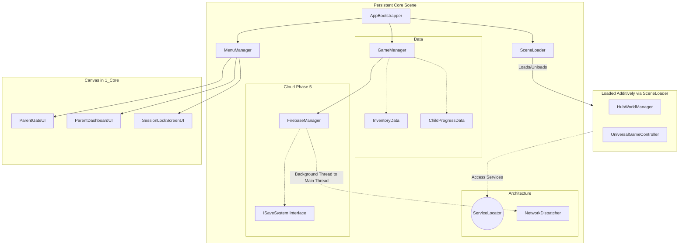
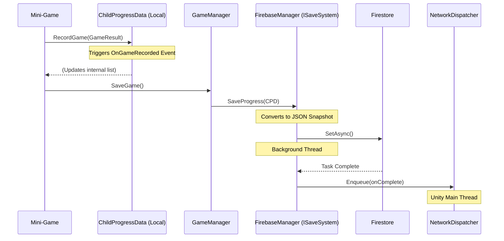

# Project FF MVP - Architectural Review & Study Guide

Welcome to the comprehensive architectural breakdown of Project FF MVP. This document serves as your definitive guide to understanding how the codebase is structured, why certain decisions were made, and how data flows through the application.

---

## 1. High-Level Architecture Diagrams

### System Architecture & Scene Structure
The project relies on a single persistent scene (`1_Core`) that manages all fundamental services and UI overlays. The actual gameplay environments (Hub, Mini-Games) are loaded and unloaded dynamically beneath this UI layer.



### Data Flow Diagram (Gameplay to Cloud)
When a child completes a mini-game, data must travel from the game to the cloud securely and efficiently.



---

## 2. Core Design Patterns (The "Why" and "How")

### A. The Service Locator Pattern (`ServiceLocator.cs`)
**What it is:** Instead of using the `Singleton` pattern (e.g., `public static GameManager Instance`) on every single manager, we have one central registry (`ServiceLocator`). Systems register themselves, and other systems ask the locator to find them.
**Why we use it:** It massively reduces tight coupling. If a mini-game explicitly references `FirebaseManager.Instance`, the mini-game breaks if you remove Firebase. By using a locator (and interfaces), the game just asks for "whatever save system is currently registered."

**Code Example:**
```csharp
// Inside GameManager's Awake() - Registering itself
ServiceLocator.Register<GameManager>(this);

// Anywhere else in the project - Finding the GameManager
var gm = ServiceLocator.Get<GameManager>();
```

### B. State Machine Logic (`SceneLoader.cs` & `MenuManager.cs`)
**What it is:** A pattern that ensures only one "State" (one UI panel, or one 3D Environment) is active at any given time.
**Why we use it:** To strictly enforce **Rule #9 (No Additive UI Scenes)**. If a child rapidly taps a button, we don't want 5 copies of a menu opening on top of each other. 

**Code Example (MenuManager):**
```csharp
// The State Machine in action. Before showing the Parent Gate, it ensures ALL other panels are disabled.
public void ShowParentGate() 
{ 
    HideAll(); // Turns off Age Entry, Role Select, etc.
    Time.timeScale = 0f; // Freezes the game running in the background
    _parentGatePanel.SetActive(true); 
}
```

**Code Example (SceneLoader):**
```csharp
// Instead of just loading a scene, we explicitly unload the old one first.
if (!string.IsNullOrEmpty(_currentActiveScene))
{
    // 1. Unload the previous environment (e.g., Hub)
    SceneManager.UnloadSceneAsync(_currentActiveScene);
}
// 2. Load the new environment (e.g., MiniGame)
SceneManager.LoadSceneAsync(nextSceneName, LoadSceneMode.Additive);
_currentActiveScene = nextSceneName;
```

### C. Dependency Injection via Interfaces (`ISaveSystem.cs`)
**What it is:** Systems interact with "Contracts" (Interfaces) rather than concrete implementations. `GameManager` doesn't know what `Firebase` is; it only knows about `ISaveSystem`.
**Why we use it:** This is how Phase 5 succeeded seamlessly. You replaced `LocalSaveSystem` with `FirebaseManager`, and the rest of the game didn't notice, because both scripts implement `ISaveSystem`.

**Code Example:**
```csharp
// GameManager just calls the interface method.
private ISaveSystem _saveSystem; // This could be Firebase OR LocalPrefs!

public void SaveGame()
{
    // It doesn't matter how it saves, as long as it fulfills the contract.
    _saveSystem.SaveProgress(_childProgressData, () => { Debug.Log("Done!"); });
}
```

### D. The Dispatcher Pattern (`NetworkDispatcher.cs`)
**What it is:** A queue that takes actions generated on background threads and runs them safely on Unity's main thread.
**Why we use it:** Unity is strictly single-threaded. Firebase performs network calls on background threads. If Firebase finishes saving and tries to update a Unity UI text element directly from its background thread, Unity will crash. `NetworkDispatcher` bridges this gap.

**Code Example:**
```csharp
// Inside FirebaseManager (Background Thread)
docRef.SetAsync(docData).ContinueWith(task =>
{
    // We are on a background thread here! Unity API calls will crash.
    // So, we send our "Complete" action to the dispatcher.
    NetworkDispatcher.Instance.Enqueue(() => 
    {
        // This runs in NetworkDispatcher's Update() loop on the Main Thread.
        onComplete?.Invoke(); 
    });
});
```

### E. The Observer Pattern (`ChildProgressData.cs`)
**What it is:** Objects broadcast events when they change, and other objects listen.
**Why we use it:** It's more performant than constantly checking variables in an `Update()` loop. When a score changes, the UI updates exactly once.

**Code Example:**
```csharp
// In the Data object
public event Action<GameRecord> OnGameRecorded;

public void RecordGame(GameRecord record)
{
    _gameHistory.Add(record);
    OnGameRecorded?.Invoke(record); // Shouts: "Hey, a game was recorded!"
}

// In a UI Script (Listening)
private void OnEnable() { _childProgressData.OnGameRecorded += UpdateUI; }
private void OnDisable() { _childProgressData.OnGameRecorded -= UpdateUI; }
```

---

## 3. The Boot Sequence (How the game starts)

When you press Play, here is the exact sequence of events, governed by `AppBootstrapper.cs`:

1.  **Unity Loads the Boot Scene:** The only thing here is the `AppBootstrapper`.
2.  **Load Core:** Bootstrapper loads `1_Core` additively. This scene contains `GameManager`, `FirebaseManager`, `SceneLoader`, `MenuManager`, and the main UI Canvas.
3.  **Awake Phase:** All managers in `1_Core` run `Awake()`, register themselves to the `ServiceLocator`, and mark themselves `DontDestroyOnLoad`.
4.  **Routing Decision:** The Bootstrapper asks `DeviceRoleManager`: "Who is holding the device?"
    *   If `Unassigned` -> Tell `MenuManager` to show Role Selection UI.
    *   If `Parent` -> Tell `MenuManager` to show the Parent Dashboard UI.
    *   If `Child` -> Check `SessionTimer`. If time is up, show Lock UI. If time is okay, tell `SceneLoader` to transition to the Hub World.

---

## 4. Evaluation & Next Steps

**Architectural Strength:** 9.5 / 10
The adherence to strict dependency direction (Data doesn't know about UI, Core doesn't know about Mini-games) makes this project highly scalable. 

**Watch Out For:**
*   **Scriptable Object State:** `ChildProgressData` and `InventoryData` are ScriptableObjects. Remember that changes made to them during Play Mode in the Unity Editor will persist after you hit Stop. We handle this with `ResetData()`, but it's important to remember for testing.
*   **MenuManager bloat:** As we enter Phase 6 and add animations to UI panels, try to keep animation logic on the specific UI Panel scripts (like `ParentGateUI`) rather than putting animation code directly into `MenuManager`.

### Study Plan

Please read the scripts in this specific order to trace the architecture yourself:
1.  `_Project/Core/AppBootstrapper.cs` (Where everything begins)
2.  `_Project/Architecture/ServiceLocator.cs` (The central hub)
3.  `_Project/Core/SceneLoader.cs` (How we move between environments without breaking UI)
4.  `_Project/UI/MenuManager.cs` (How we prevent UI overlaps)
5.  `_Project/Core/FirebaseManager.cs` (Look specifically for the `NetworkDispatcher` usage)

Once you have reviewed this document and the source code, we will be perfectly positioned to tackle **Phase 6: UI/UX Polish**, knowing that the foundation underneath is rock solid.