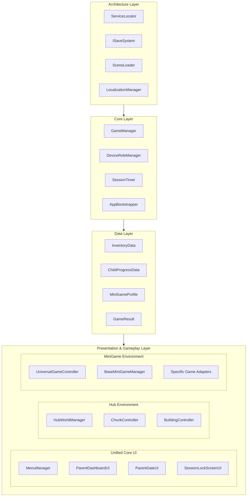
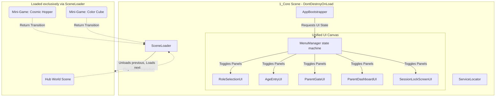
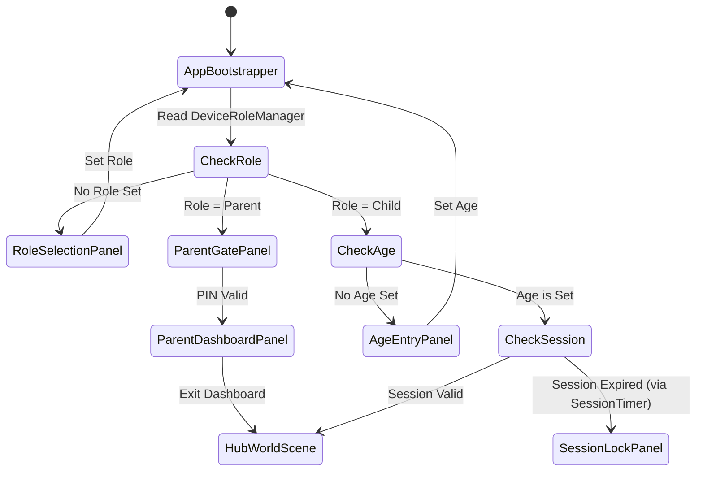
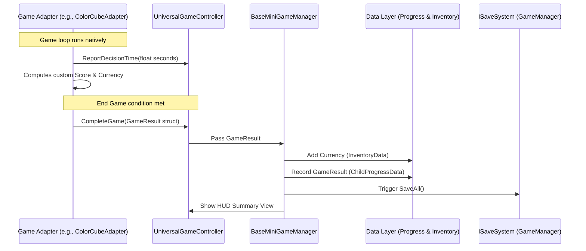
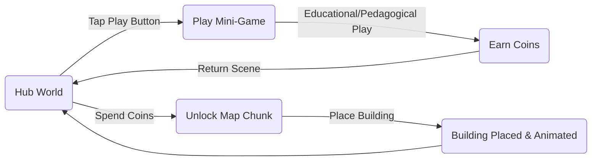

# Project FF MVP — Architecture & Flow Diagrams

This document visualizes the current structural solidity, connections, and workflows of **Project FF MVP**. It is designed to assist software engineers in reviewing the architecture, data pipelines, and scene management strategies implemented up to Phase 4.

---

## 1. Core Architecture & Dependency Layers

The project strictly adheres to a one-way dependency rule: `Architecture → Core → Data → UI/Hub/MiniGames`. 
- **Rule:** No file in `Core` imports from `UI` or `Hub`. No file in `Data` imports from `MiniGames`.

---

## 2. Scene Architecture & Navigation (Unified Core UI)

As of Phase 4 (Step 6), additive UI scenes are **banned**. All core UI panels live in a single persistent `1_Core` scene managed by the `MenuManager`. The environments (Hub vs MiniGames) are cleanly transitioned using `SceneLoader` to prevent additive memory leaks or camera clashes.

---

## 3. App Initialization & Bootstrapping Flow

The `AppBootstrapper` routes the initial launch directly through the `MenuManager` panel toggles based on role, age configuration, and session timer constraints.

---

## 4. Mini-Game Data & Scoring Pipeline

The scoring system avoids generic engine over-engineering. Each mini-game has its own scoring/timing logic within its `Adapter`. The `UniversalGameController` serves strictly as an event receiver pipeline mapping `GameResult` data to the `ChildProgressData` system.

---

## 5. Child User Core Loop

The psychological loop driving engagement and educational value. Instant positive feedback and ownership drive progression.

