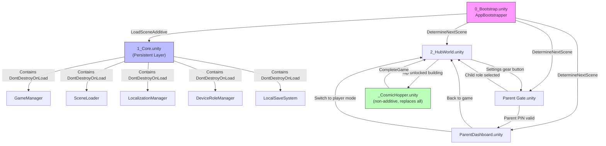
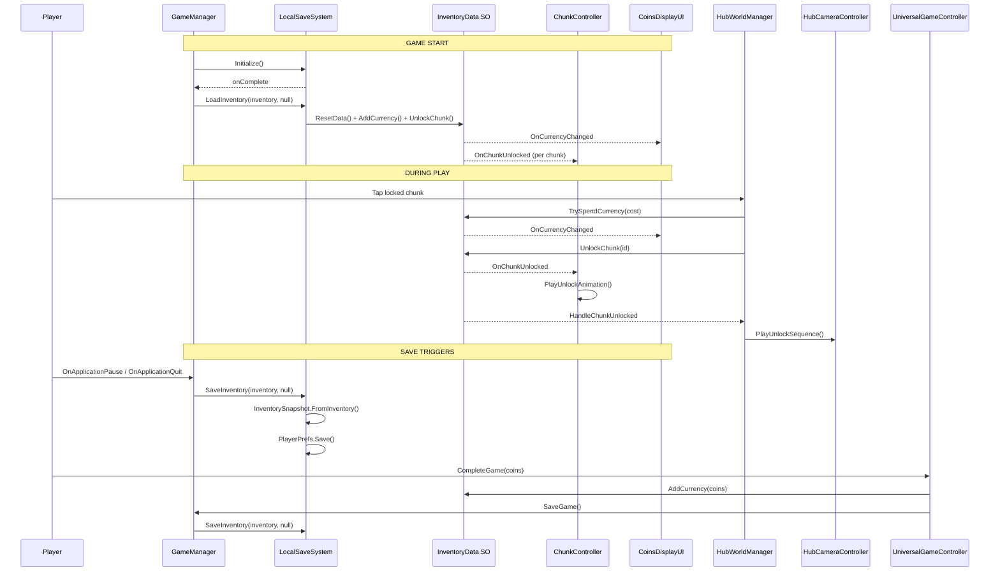
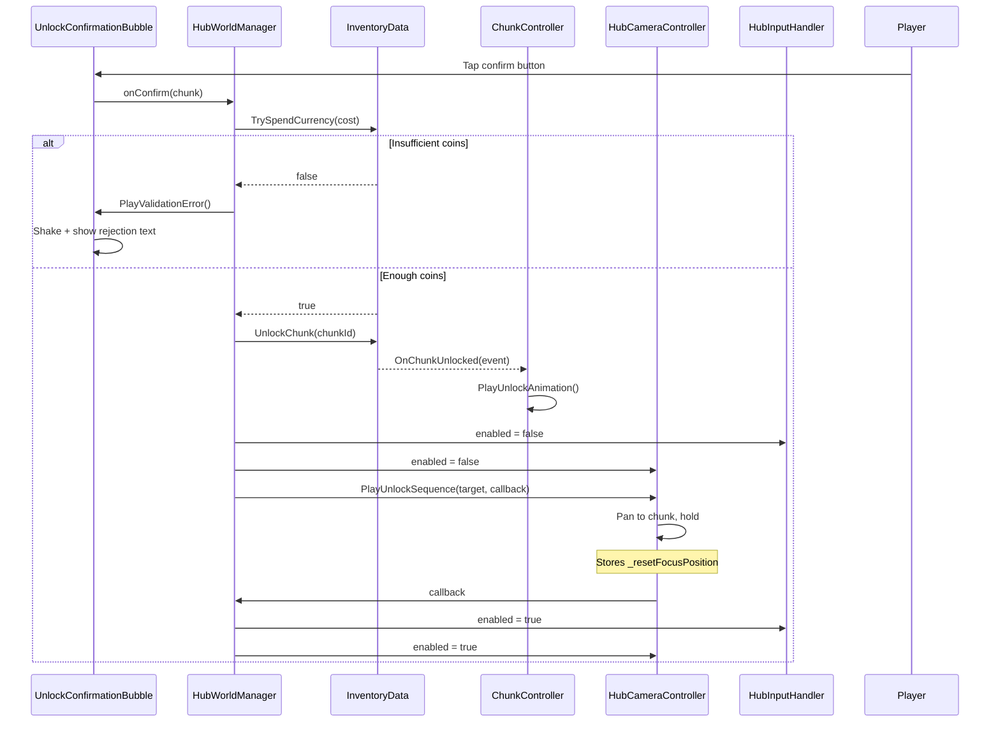

# Project FF — Architecture Diagrams

## 1. Scene Flow

---

## 2. Core Class Dependencies

```mermaid
classDiagram
    class ISaveSystem {
        <<Interface>>
        +Initialize(Action onComplete)
        +SaveInventory(InventoryData, Action)
        +LoadInventory(InventoryData, Action)
    }

    class LocalSaveSystem {
        +Initialize()
        +SaveInventory()
        +LoadInventory()
    }

    class GameManager {
        +Instance
        -InventoryData _inventoryData
        -ISaveSystem _saveSystem
        +SaveGame()
    }

    class ServiceLocator {
        +Register&lt;T&gt;(T)$
        +Get&lt;T&gt;()$ T
    }

    class TweenableMonoBehaviour {
        <<Abstract>>
        #OnDestroy()
    }

    class CameraUtility {
        +ResolveCamera(Camera, Component)$ Camera
    }

    class InventoryData {
        -int SoftCurrency
        -List~string~ UnlockedChunkIds
        +AddCurrency()
        +TrySpendCurrency()
        +UnlockChunk()
        +HasUnlockedChunk()
        +OnCurrencyChanged
        +OnChunkUnlocked
    }

    class InventorySnapshot {
        +int softCurrency
        +List~string~ unlockedChunkIds
        +FromInventory(InventoryData)
        +ApplyTo(InventoryData)
    }

    class GameSceneConfig {
        +HubSceneName
        +CoreSceneName
        +ParentGateSceneName
        +ParentDashboardSceneName
    }

    class HubWorldManager {
        -InventoryData _inventoryData
        -ChunkController[] _chunks
        -HubCameraController _cameraController
        -HubInputHandler _inputHandler
        -UnlockConfirmationBubble _activeBubble
        +HandleChunkUnlocked(string)
    }

    class ChunkController {
        +Initialize(InventoryData)
        +PlayUnlockAnimation()
        -HandleGlobalChunkUnlocked()
    }

    class HubCameraController {
        -Camera _hubCamera
        -bool _isSequenceRunning
        +PlayUnlockSequence(Transform, Action)
        +ResetCamera()
        -HandleCameraDrag()
    }

    class HubInputHandler {
        +OnInteractableTapped
    }

    class UIHelper {
        +IsPointerOverUI()$
    }

    class ParentGateUI {
        -GameSceneConfig _sceneConfig
        -PinValidationView _pinValidation
        +SelectParentRole()
        +SelectChildRole()
        +OnCancelPressed()
    }

    class PinValidationView {
        -PinKeypadUI _keypad
        +OnPinValidated
        +OnPinRejected
        +ResetInput()
        +HideError()
        -HandlePinSubmitted(string)
    }

    class PinKeypadUI {
        +OnPinSubmitted
        +OnInputChanged
        +ResetInput()
    }

    class BaseMiniGameManager {
        #InventoryData _inventoryData
        #GameSceneConfig _sceneConfig
        +StartGame()
        +CompleteGame(int)
    }

    class UniversalGameController {
        -GameRuleConfig _ruleConfig
        -IGameRule _gameRule
        +ReportScore()
        +ReportPlayerDeath()
    }

    class IGameRule {
        <<Interface>>
        +IsGameOver
        +CalculateReward()
    }

    GameManager --> ISaveSystem : uses
    GameManager --> ServiceLocator : registers/resolves
    LocalSaveSystem ..|> ISaveSystem
    GameManager --> InventoryData : owns
    InventorySnapshot ..> InventoryData : serializes
    LocalSaveSystem --> InventorySnapshot : uses

    ChunkController --|> TweenableMonoBehaviour
    BuildingController --|> TweenableMonoBehaviour
    UnlockConfirmationBubble --|> TweenableMonoBehaviour

    HubCameraController --> CameraUtility : resolves camera
    HubInputHandler --> CameraUtility : resolves camera

    HubWorldManager --> InventoryData : reads/writes
    HubWorldManager --> ChunkController : owns[]
    HubWorldManager --> HubCameraController : orchestrates
    HubWorldManager --> HubInputHandler : listens

    ChunkController ..> InventoryData : listens events
    HubCameraController ..> UIHelper : uses
    HubInputHandler ..> UIHelper : uses

    ParentGateUI --> PinValidationView : delegates
    PinValidationView --> PinKeypadUI : owns
    PinValidationView ..> DeviceRoleManager : validates

    BaseMiniGameManager --> InventoryData : writes
    BaseMiniGameManager --> GameSceneConfig : reads
    UniversalGameController --|> BaseMiniGameManager
    UniversalGameController --> IGameRule : delegates
```

---

## 3. Save / Load Lifecycle

---

## 4. Chunk Unlock Flow (Detail)

---

## 5. Namespace Organization

```mermaid
flowchart LR
    subgraph Architecture["Project.Architecture"]
        ISaveSystem
        NetworkDispatcher
        ServiceLocator
        TweenableMonoBehaviour
        CameraUtility
    end

    subgraph Core["Project.Core"]
        GameManager
        SceneLoader
        AppBootstrapper
        DeviceRoleManager
        LocalizationManager
        LocalSaveSystem
        FirebaseManager
    end

    subgraph Data["Project.Data"]
        InventoryData
        InventorySnapshot
        GameSceneConfig
        ChildSessionData
        LocalizationData
    end

    subgraph Hub["Project.Hub"]
        HubWorldManager
        ChunkController
        BuildingController
        HubCameraController
        HubInputHandler
    end

    subgraph MiniGames["Project.MiniGames"]
        BaseMiniGameManager
        UniversalGameController
    end

    subgraph Rules["Project.MiniGames.Rules"]
        IGameRule
        GameRuleConfig
        ScoreTargetRule
        SurvivalRule
        StepRule
    end

    subgraph UI["Project.UI"]
        ParentGateUI
        ParentDashboardUI
        PinKeypadUI
        PinValidationView
        CoinsDisplayUI
        UnlockConfirmationBubble
        UniversalMiniGameHUD
        LocalizedRTLText
        UIHelper
    end

    Hub --> Architecture
    Hub --> Data
    Hub --> UI
    MiniGames --> Data
    MiniGames --> UI
    MiniGames --> Rules
    UI --> Core
    UI --> Data
    Core --> Architecture
    Core --> Data
```

