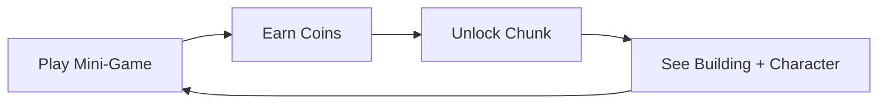
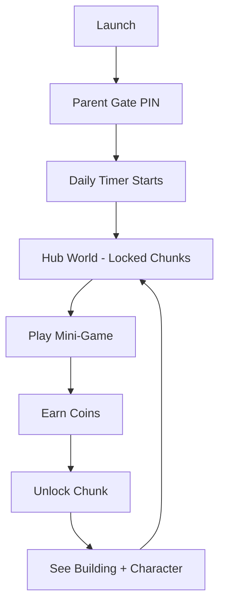

# Project FF MVP — Master Plan

---

## 1. Product Overview

A free-to-play educational mobile game for kids aged **3–8**, blending 2D mini-games with 3D isometric world-building.

**Two Tiers:**
- **Under 6:** Short sessions (≤30 min), simpler games, voice + icon driven (no text).
- **Ages 6+:** Longer play limits, advanced progression.

**North Star:** Parents hand the device to their child with total trust — safe, productive, educational.

---

## 2. Core Game Loop

- **Play:** 2D mini-games (endless, educational, story-driven) → earn coins.
- **Build:** Spend coins to unlock map chunks and place buildings.
- **Expand:** Each chunk reveals buildings + character homes → kid feels ownership.

---

## 3. The Hook: Character Interaction

- A character asks for help: *"My city is empty. Will you help me build it?"*
- Characters cheer during mini-games with voice lines.
- When a building is finished, the character moves in.

---

## 4. Experience Flow

### Child

### Parent
- Grants permission via PIN.
- Sets daily playtime limits.
- Receives progress reports: *"Your child excels at X, needs practice with Y."*

---

## 5. Demo Deliverables

| Priority | Deliverable |
|----------|-------------|
| **P0** | 2.5D hybrid loop — play → earn → unlock → see |
| **P0** | Parent gate — PIN screen at launch |
| **P0** | One complete mini-game — playable, wired, rewards |
| **P0** | Isometric hub with chunk system — grid, locked/unlocked, animations |
| **P1** | Architecture & localization — clean separation, Arabic/English, RTL |
| **P1** | UI/UX — icon-driven, kid-friendly, bright, instant feedback |
| **P1** | Cloud auth & save — Firebase auth + cloud persistence |
| **P2** | Character companion — voice lines, presence in hub |
| **P2** | Reward celebration screen — coins, animations, character reaction |
| **P2** | Session timer — enforce daily play limit |

---

## 6. Phases & Schedule

### Pre-Phase — Project Cleanup (Done)
**Focus:** Remove unused assets, fix broken references before building.

- [x] Remove `3_Slingshot` from Build Settings
- [ ] ~~Delete unused template scripts~~ — postponed, may reuse later
- [ ] ~~Other fixes~~ — working as-is, leave alone

### Phase 1 — Foundation (Week 1)
**Focus:** Entry point, structure, language support, cloud.

- [x] Parent gate — PIN screen + validation
- [x] Architecture — clean separation (data, core, hub, UI, mini-games)
- [x] Localization — Arabic / English, RTL text support
- [x] Firebase — stubs/mocks ready for integration

### Phase 2 — Hub World (Week 2)
**Focus:** The 3D isometric map with chunk unlocking.

- [x] Isometric grid system — locked chunks visible, unlock animation
- [x] Building placement — spend coins → place building on chunk
- [x] Hub UI — confirmation bubble (icon-driven, no text dependence)
- [x] Currency loop — earn → spend → unlock → see result

### Phase 3 — Mini-Game (Week 3)
**Focus:** One complete playable game wired to the hub.

- [x] One playable mini-game — polished, fun, repeatable
- [x] Hub integration — play button → game → earn coins → return to hub
- [x] Reward screen — show coins earned, positive feedback

### Clean Up Phase (Completed)
**Focus:** Code modularity, low coupling, and event-driven decoupling.

- [x] Extract dedicated camera drag/reset and raycast input controllers
- [x] Decouple UI confirmation bubble from physical chunks and inventory
- [x] Build local persistent save system fallback
- [x] Completely localize dashboard texts and coins HUD labels

### Architecture Refactoring Phase (Completed)
**Focus:** Systematic code audit, tech debt elimination, singleton decoupling.

- [x] Create `TweenableMonoBehaviour` base class — eliminate duplicated DOKill across 3 components
- [x] Extract `CameraUtility` — deduplicate camera auto-find pattern
- [x] Fix `HubCameraController` double-initialization (Awake + Start redundancy)
- [x] Split `ParentGateUI` — flow controller + `PinValidationView`
- [x] Add `SceneLoader.LoadSceneSingle` — enable non-additive scene switches through abstraction
- [x] Replace raw `SceneManager.LoadScene` in `HubWorldManager` with `SceneLoader`
- [x] Fix ScriptableObject state bleed — `InventoryData.ResetData()` on game start
- [x] Make `ParentDashboardUI` reactive — subscribe to progress events
- [x] Create `ServiceLocator` — all 6 singletons register centrally, resolve via `Get<T>()`
- [x] Remove orphan `GameManager`/`SceneLoader` GameObjects from HubWorld scene

### Phase 4 — Polish & Ship (Week 4)
**Focus:** Character, safety, QA.

- [ ] Character companion — simple DOTween animations, voice lines in hub
- [ ] Session timer — daily limit enforcement
- [ ] End-to-end QA — full loop test, bug fixes
- [ ] Build target — Android APK ready

> **Note:** UI/UX and character interactions will be the most time-consuming. Keep animations simple (DOTween scale/fade/move, no complex state machines). Character presence can be minimal for MVP — a static NPC with a voice line on key events is enough.

---

## 7. Current Status

| Phase | Status |
|-------|--------|
| Phase 1 — Foundation | ✅ Complete. Parent Gate fully integrated, scene load routing configured, RTL Arabic localization active, Firebase stubs active. |
| Phase 2 — Hub World | ✅ Complete. Isometric chunk grid, tap-to-unlock with confirmation bubble, camera pan sequence, DOTween unlock animation, coins UI on top bar, scene-saving tool. (Category validation postponed to W4). |
| Phase 3 — Mini-Game | ✅ Complete. Cosmic Hopper playable. Hub → game → earn → return loop works. |
| Clean Up Phase | ✅ Complete. Decoupled and refactored core, camera, inputs, save fallback, and UI localizations. |
| Architecture Refactoring | ✅ Complete. Code audit fixes, ServiceLocator, singleton mesh decoupling, scene cleanup. |
| Phase 4 — Polish & Ship | ⏳ Next up. Character companion, session timer, QA, and Android build target. |

---

## 8. Key Principles

1. **Voice + icons over text** — kids under 6 may not read.
2. **Feedback is fuel** — every action needs instant positive reaction.
3. **Forced variety** — each chunk requires games from multiple categories.
4. **Ownership drives retention** — visible progress keeps kids coming back.
5. **Parent trust is the product** — safety features are not optional.

---

## 9. What NOT to Do

- Do not add gameplay complexity before the core loop works end-to-end.
- Do not build multiple mini-games until one is fully wired.
- Do not invest in polish until the playable loop is solid.
- Do not ship without a parent gate.
- Do not add text-dependent UI.
