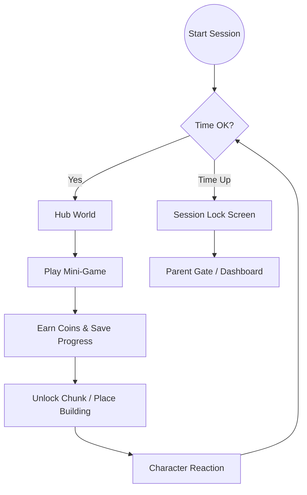
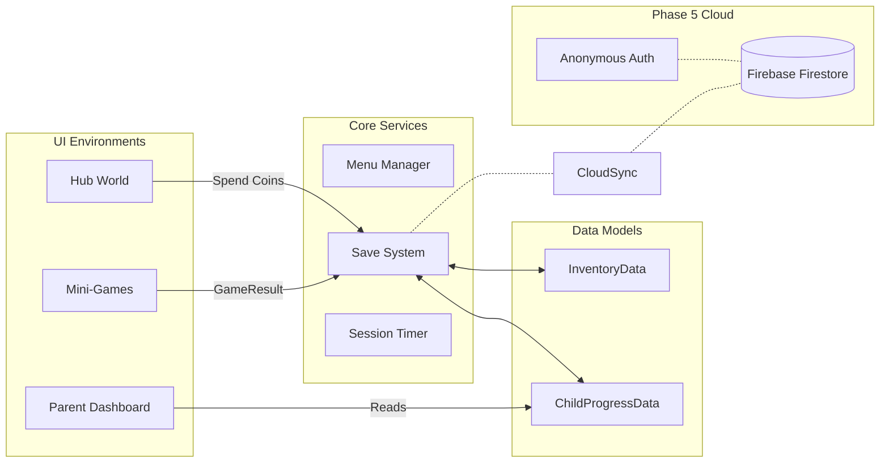

# Project FF MVP — Master Plan

---

## 1. Product Overview

A free-to-play educational mobile game for kids aged **3–8**, blending 2D mini-games with 3D isometric world-building.

**Two Tiers:**
- **Under 6:** Short sessions (≤30 min), simpler games, voice + icon driven.
- **Ages 6+:** Longer play limits, advanced progression.

**North Star:** Parents hand the device to their child with total trust — safe, productive, educational.

---

## 2. Core Game Loop & The Hook

- **Play:** 2D mini-games (educational, story-driven) → earn coins.
- **Build:** Spend coins to unlock map chunks and place buildings.
- **Expand:** Each chunk reveals buildings + character homes → kid feels ownership.
- **Limit:** The loop is safely constrained by a daily session timer.

**The Hook (Character Interaction):**
- Characters ask for help: *"My city is empty. Will you help me build it?"*
- Characters cheer during mini-games with voice lines.
- When a building is finished, the character moves in.

---

## 3. System & Data Architecture (Phases 4 & 5)

---

## 4. Key Principles

1. **Voice + icons over text** — kids under 6 may not read. Every instruction must work without text.
2. **Feedback is fuel** — every action (coin earned, chunk unlocked) needs an instant positive reaction.
3. **Forced variety** — each chunk requires games from multiple categories.
4. **Ownership drives retention** — visible progress keeps kids coming back.
5. **Parent trust is the product** — safety features (parent gate, time limits) are non-negotiable.

**What NOT to Do:**
- Do not add gameplay complexity before the core loop works end-to-end.
- Do not ship without a parent gate.
- Do not add text-dependent UI in child-facing flows.
- Do not start UX polish until backend & cloud integrations are stable.

---

## 5. Current Status

| Phase | Status |
|-------|--------|
| Phase 1 — Foundation (Arch, Localization, Parent Gate) | ✅ Complete |
| Phase 2 — Hub World (Isometric Grid, Buildings, Economy)| ✅ Complete |
| Phase 3 — Mini-Games (Integration & Refactoring) | ✅ Complete |
| Phase 4 — Data, UI & Infrastructure | ✅ Complete |
| **Phase 5 — Firebase & Cloud Persistence** | **🚧 Next / Ready** |
| Phase 6 — UI/UX Polish & Character Integration | ⏳ Future |
| Phase 7 — QA, Launch & Build | ⏳ Future |

---

## 6. Development Phases

### ✅ Phases 1–4: Core Foundation & Infrastructure (Completed)
*All tech debt refactoring, structural work, and data pipelines have been merged and completed.*
- **Data & Profiles:** Standardized `GameResult` pipeline. `MiniGameProfile` metadata (Edu/Ped/Ent weights) implemented.
- **Progress Tracking:** Detailed `ChildProgressData` capturing session duration, decision times, and per-category performance.
- **Parent Controls:** Session timer enforcing daily play limits. Age tier constraints. Parent Dashboard V2 with strength/weakness analytics.
- **Menus & UI:** Unified state-machine UI via `MenuManager` in `1_Core`. No additive scene loading for menus.
- **Mini-Games:** Two fully wired games (Cosmic Hopper, Color Cube) flowing smoothly into the hub.

---

### 🚧 Phase 5: Firebase & Cloud Persistence (Standalone)
**Focus:** Replace the mock save system with real Firebase Auth and Firestore for true cross-session persistence. *Must be completed before final polish to ensure data stability.*

- **Firebase Auth:** Implement anonymous sign-in linked to device ID.
- **Firestore Database:** 
  - Read/Write `InventorySnapshot` (coins, chunks).
  - Read/Write `ProgressSnapshot` (session history, stats).
- **Offline Fallback:** 
  - Cloud-first save architecture.
  - If offline, fallback seamlessly to `LocalSaveSystem`.
  - On next online boot, sync local changes up to the cloud.
- **UI Feedback:** Add subtle, non-intrusive cloud-sync indicators in the Parent Dashboard.

---

### ⏳ Phase 6: UI/UX Polish & Character Integration (Expanded)
**Focus:** Transform the functional MVP into a joyful, toddler-friendly experience with high retention, visual juice, and character presence.

**1. Character Companion & The Hook**
- Implement a 3D character in the Hub World environment.
- Add simple, playful DOTween animations (idle, wave, cheer, jump).
- Integrate voice lines ("Yay!", "Let's build!") triggering on specific game events.

**2. Visual Juice & Instant Feedback**
- **Economy:** Particle bursts and flying coin animations when earning and spending.
- **Interactions:** Bouncy squash & stretch animations on all child-facing buttons.
- **Celebrations:** Dedicated reward overlay screen when returning from a mini-game.

**3. Toddler-Focused UX Refinements**
- Ensure absolute zero reliance on text for child navigation (fully icon/color driven).
- Use vibrant, consistent color coding for different game categories.
- Pop-up animations (bounce-in) for UI panels instead of instant, rigid appearances.

**4. Camera & Control Polish**
- Smoother drag/pan mechanics with inertia in the Hub map.
- Soft camera focus transitions when unlocking a new chunk or zooming in on a building.

---

### ⏳ Phase 7: QA & Launch
- End-to-end user loop testing.
- Edge-case testing for session expirations and offline saves.
- Android APK optimization & final build process.

---

## 7. Deliverables & Priorities

*Updated to reflect remaining work (Completed P0 items removed for clarity).*

| Priority | Deliverable | Status |
|----------|-------------|--------|
| **P0** | **Firebase Auth & Firestore Integration (Phase 5)** | Pending |
| **P0** | **Offline fallback & local sync (Phase 5)** | Pending |
| **P1** | Character companion model & 3D placement (Phase 6) | Pending |
| **P1** | Voice lines & audio feedback integration (Phase 6) | Pending |
| **P1** | Visual polish (particles, UI DOTween juice) (Phase 6) | Pending |
| **P1** | Camera movement & focus enhancements (Phase 6) | Pending |
| **P2** | Additional mini-games & expansions | Future Scope |
| **P2** | App Store / Play Store prep (Phase 7) | Future Scope |
